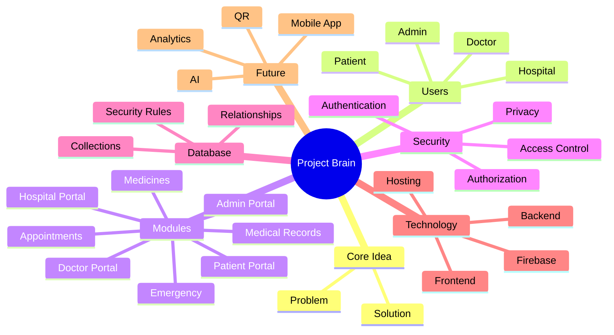

# 🧠 Project Brain: United Medication Inc (UMIC)

> A central visual knowledge base and architectural mind map of the United Medication Inc internationally digitalized healthcare ecosystem.

---

## Central Idea

### Project Purpose
- **Mission:** Establish a unified, paperless, and internationally connected digital healthcare network connecting patients, caretakers, doctors, clinics, hospitals, and national administrators.
- **Motto:** *"One patient. One record. One connected journey."*
- **Objective:** Eliminate fragmentation across hospital systems, streamline clinical consults, provide lifetime continuous health histories, and ensure emergency vital information is instantly available anywhere across the globe.

### Main Problem
- **Fragmented Medical Histories:** Patient records are scattered across disparate private clinic computers, paper files, separate hospital archives, and diagnostic centers.
- **Emergency Blindspots:** During trauma, ambulance transit, or sudden illness, critical data (blood group, allergies, past surgeries, active prescriptions) is unavailable or delayed.
- **Medication Mismanagement & Errors:** Incomplete past drug regimens lead to adverse cross-drug interactions, redundant prescriptions, or skipped dosages.
- **Friction in Access & Verification:** Sharing medical records currently requires photocopies or insecure messaging apps lacking identity verification and consent tracking.

### Main Solution
- **Single Digital Health Identity (Health ID):** A verified unique identifier (`UMIC-XXXX-XXXX`) linked to a single lifetime longitudinal patient timeline.
- **Unified Multi-Role Portals:** Tailored, synchronized experiences for Patients, Caretakers, Doctors, Hospitals, and Administrators connected to the same real-time data spine.
- **Instant Emergency & QR Access:** Portable Health QR tokens and biometric-assisted access allowing authorized clinicians to retrieve emergency medical cards in seconds without exposing entire raw private histories.
- **Doctor-Verified Records & Real-Time Coordination:** Verified case notes, lab diagnostics, prescription tracking, and direct consultation requests in a synchronized cloud architecture.

---

## 👥 Users & Roles

### Patient
- **Identity & Health Card:** Possesses a unique Health ID and cryptographic Health QR token.
- **Core Needs:** Manage their personal health timeline, monitor active medicines, view lab diagnostics, book consultations, manage caretaker permissions, and trigger emergency protocols.
- **Capabilities:**
  - View longitudinal medical history, vitals, allergy lists, and immunization logs.
  - Review and check off active medication schedules with adherence tracking.
  - Schedule appointments with affiliated doctors or hospital OPDs.
  - Authorize or revoke access for doctors, hospitals, and family caretakers.
  - Generate emergency medical cards accessible via emergency scan.

### Doctor
- **Credentials & Specialization:** Verified clinical practitioners with license numbers, department affiliations, and consultation fees.
- **Core Needs:** Review verified clinical background, conduct consultations, log diagnoses, issue e-prescriptions, order lab tests, and track patient progress.
- **Capabilities:**
  - Search and request access to patient records using Health ID or QR scan.
  - Record consultation case notes, ICD/diagnosis codes, vitals, and treatment plans.
  - Issue structured digital prescriptions directly linked to the patient's medicine tracker.
  - Request and accept hospital affiliations across multiple healthcare facilities.
  - Monitor follow-ups, earnings, and asynchronous clinical inquiries.

### Hospital
- **Institutional Infrastructure:** Hospitals, medical centers, and specialized healthcare facilities.
- **Core Needs:** Oversee outpatient departments (OPD), inpatient admissions, diagnostic labs, doctor staff affiliations, bed allocations, and billing.
- **Capabilities:**
  - Verify and register walk-in or admitted patients into the institutional directory.
  - Manage affiliated physicians, departments, and consultation schedules.
  - Upload verified laboratory results, imaging reports, and discharge summaries.
  - Manage patient invoicing, billing items, and emergency bed coordination.

### Admin
- **System & Administrative Authority:** Hospital super-administrators and National Healthcare Oversight Administrators (Government Admin).
- **Core Needs:** System integrity, audit logging, facility verification, clinical credential approvals, and national health analytics.
- **Capabilities:**
  - Audit cross-system activity logs and monitor active user sessions.
  - Verify and approve doctor licenses and hospital institutional registrations.
  - Manage system-level counters, feature flags, security policies, and incident reports.
  - Oversee anonymized epidemiological metrics and regional healthcare indicators.

---

## 🧩 Core Modules

### Patient Portal
- **Dashboard & Vitals:** Live cards displaying BMI, BP, pulse, upcoming appointments, and medication adherence.
- **Health Timeline & Cases:** Chronological ledger of all clinical encounters, doctor consultations, and diagnoses.
- **Health QR & Digital ID:** Dynamic display of the patient's digital health pass with copyable Health ID and download options.
- **Caretaker Management:** Assignment of trusted relatives or professional caregivers with permission levels.

### Doctor Portal
- **Clinical Workbench:** Active patient queue, upcoming appointment alerts, and rapid search by Health ID.
- **Patient Verification Console:** Two-step verification using Health ID/QR before granting access to sensitive records.
- **Case Notes & Prescriptions:** Rich clinical note entry, vital recording, dosage calculator, and prescription generator.
- **Hospital Affiliations & Revenue:** Management of clinical credentials, facility ties, and fee tracking.

### Hospital Portal
- **Facility Registry:** Department listings, bed/ward status, and staff roster.
- **Diagnostic Upload Hub:** Structured upload of radiology images, pathology reports, and biochemistry results linked to patient IDs.
- **Billing & Admissions:** Patient checkout, procedural invoices, and encounter history.

### Admin Portal
- **National / System Overview:** High-level platform statistics (total patients, active doctors, registered hospitals, daily consultations).
- **Credential Approvals:** Verification queue for doctor medical council registrations and hospital accreditations.
- **Security Audit Logs:** Comprehensive event stream monitoring authentication attempts and data access.

### Authentication
- **Multi-Method Sign-In:** Email/password authentication, persistent remember-me options, and session restoration.
- **WebAuthn / Biometrics:** Native fingerprint and passkey integration for seamless identity validation.
- **Demo Quick-Access:** Instant pre-configured sandbox credentials for all four major roles for zero-friction evaluation.

### Medical Records
- **Longitudinal Case Ledger:** Permanent records of diagnoses, treatment plans, clinical summaries, and physician stamps.
- **Document Attachments:** Secure cloud-stored diagnostic scans, discharge slips, and lab PDFs.
- **Categorized History:** Categorized by chronic conditions, surgical procedures, allergies, and family history.

### Appointments
- **Booking Engine:** Selection of specialty, hospital facility, consulting doctor, date, and preferred time slot.
- **Status Lifecycle:** `Pending` → `Confirmed` → `In-Consultation` → `Completed` / `Cancelled`.
- **Calendar Synchronization:** Upcoming consultation countdowns and reminder notifications.

### Medicines
- **Active Prescription Tracker:** Digital pillbox detailing medicine name, dosage, frequency, and food instructions.
- **Adherence Checklist:** Daily check-offs with visual compliance bars for patients and monitoring alerts for caretakers.
- **Refill Reminders:** Low-supply warnings and doctor renewal requests.

### Reports / Results
- **Diagnostic Catalog:** Blood panels, urine analyses, MRI/CT scans, ECG tracings, and pathology biopsies.
- **Doctor Verification Badges:** Official verification indicators confirming clinical review by an authorized pathologist or physician.
- **Historical Comparison:** Trend visualization for blood sugar, cholesterol, HbA1c, and vital indicators.

### Emergency
- **Rapid SOS Overlay:** Prominent one-tap emergency trigger on all patient interfaces.
- **Critical Care Card:** Read-only access to life-saving data: blood type, severe allergies, emergency contacts, DNR status, and chronic conditions.
- **Nearby Facility Locator:** Geo-aware locator displaying emergency rooms and hospitals.

### Notifications
- **In-App Toast & Feed:** Real-time alerts for appointment confirmations, prescription refills, and test result arrivals.
- **Emergency Broadcasts:** High-priority alerts to assigned caretakers and designated hospital emergency desks.

### Privacy & Access Control
- **Explicit Consent Model:** Doctors and hospitals can only read full longitudinal records when explicitly authorized or verified via patient token.
- **Permission Scopes:** Granular toggles allowing patients to hide sensitive sections (e.g., mental health, reproductive history).

---

## 🗄️ Database

### Collections
- `users`: Core profile documents for Patients, Doctors, Hospitals, and Admins.
- `cases`: Clinical encounter records, symptoms, diagnoses, physician notes, and treatment dates.
- `appointments`: Scheduled and completed consultations between patients and clinicians.
- `medicines`: Prescribed drugs, dosage schedules, duration, and compliance check-ins.
- `reports`: Diagnostic lab results, imaging scans, and pathologist reviews.
- `activity`: Timestamped audit trail of platform events, sign-ins, and data requests.
- `notifications`: User-directed alerts, reminders, and status changes.
- `hospital_requests`: Doctor-hospital affiliation requests and inter-facility transfers.
- `system/counters`: Global platform sequence numbers and registry counters.
- `webauthnCredentials` & `webauthnChallenges`: Server-side storage for biometric passkeys.

### Documents
- **Hierarchical Document Model:** Firestore NoSQL documents utilizing strongly-typed JSON schema conventions.
- **Embedded Sub-Objects:** Nested structures for vitals (`{ systolic, diastolic, pulse, temp, spo2 }`), emergency contacts, and address records.

### Relationships
- **Patient to Records:** `1:N` link between `users[patientId]` and `cases`, `medicines`, `reports`, and `appointments`.
- **Doctor to Patient Encounters:** `1:N` link via `cases.doctorId` and `appointments.doctorId`.
- **Hospital to Affiliations:** `M:N` relationship between `users[hospitalId]` and doctors via `hospital_requests`.
- **Patient to Caretaker:** `1:N` or `N:M` permission mapping in `users[patientId].caretakers`.

### Important Fields
- `healthId`: Unique alphanumeric identifier (e.g., `UMIC-9024-1182`).
- `role`: Role enum (`patient`, `doctor`, `hospital`, `admin`, `caretaker`).
- `emergencyData`: Critical blood group, allergies, implants, and guardian contact numbers.
- `status`: Status indicators for appointments, verification requests, and affiliation contracts.
- `verifiedBy`: Doctor license ID stamped onto clinical reports and prescription entries.

### Security Rules
- **Role Verification:** Firestore security rules restricting mutations based on authenticated UID and role checks.
- **User Segregation:** Patients can only edit their own profile preferences; clinical notes are write-restricted to authorized doctors.
- **Sensitive WebAuthn Protection:** Direct client read/write to `webauthnCredentials` is disabled (`allow read, write: if false;`), handled exclusively via secure server/Cloud Function execution.

---

## 🔐 Security

### Authentication
- Firebase Authentication with email, password, and session token persistence.
- Optional WebAuthn / FIDO2 biometric fingerprint authentication for local hardware-backed identity verification.
- Protected route guards preventing unauthenticated access or role mismatch redirects.

### Authorization
- Principle of Least Privilege: Every role is bound strictly to its respective dashboard workspace.
- Doctors cannot alter hospital operational settings; hospitals cannot fabricate clinical notes without doctor credentials.
- Admins possess oversight capability without unencrypted casual browsing of private patient narratives.

### Role-Based Access Control (RBAC)
- **Patient:** Read/write personal demographics; read-only clinical notes; grant/revoke doctor consent.
- **Doctor:** Write consultation notes, prescriptions, and lab orders; read patient records with active authorization.
- **Hospital:** Manage facility rosters, upload diagnostic documents, manage ward admissions.
- **Admin:** System audit monitoring, verification of clinical licenses, maintenance of national registry.

### Data Privacy
- **Tokenized QR Codes:** QR codes emit secure temporary tokens/identifiers rather than raw, unencrypted medical histories.
- **Zero Public Indexing:** Strict `robots.txt` and private cloud rules preventing search indexing of patient records.
- **Compliance Alignment:** Architecture crafted to support HIPAA, GDPR, and India's Ayushman Bharat Digital Mission (ABDM) guidelines.

### Access Permissions
- **Granular Caretaker Delegations:** Patients can designate caretakers with read-only medicine monitoring permissions without financial or clinical alteration rights.
- **Time-Bound Consultation Sessions:** Doctor access grants can expire after consultation conclusion or discharge.

---

## 🔄 Workflows

### Patient Registration
```text
User fills registration form → Assigns unique Health ID → Initializes baseline profile 
→ Registers emergency contacts & blood group → Generates cryptographic Health QR token
```

### Doctor Access Request
```text
Doctor enters Patient Health ID or scans Health QR → Verification modal triggers 
→ Consent validated → Patient records unlocked in Doctor workbench → Case session begins
```

### Hospital Interaction
```text
Patient presents at Hospital desk → Receptionist verifies Health ID in Hospital Portal 
→ Patient assigned to Department OPD → Doctor conducts exam → Hospital lab uploads verified report
```

### Appointment Workflow
```text
Patient searches Doctor/Specialty → Selects slot & confirms booking → Doctor receives alert 
→ Appointment marked In-Progress → Consultation occurs → Record automatically appended to Case Ledger
```

### Medical Record Workflow
```text
Doctor inputs Vitals, Symptoms, & Diagnosis → Prescribes Medicines with dosage instructions 
→ Attaches diagnostic tests → Stamped with Doctor ID → Real-time sync to Patient Timeline & Medicine Checklist
```

### Emergency Workflow
```text
First responder or paramedic scans Patient Emergency QR → Instant view of Emergency Critical Card 
(Blood Group, Allergies, Current Meds, Emergency Phone) → One-tap call to Guardian → Nearest Hospital alerted
```

---

## 💻 Technology Stack

### Frontend
- **Framework:** React 19 with TypeScript.
- **Build Tool:** Vite for lightning-fast HMR and optimized production bundling.
- **Styling:** Tailwind CSS 4 with custom dark emerald aesthetic, design tokens, and modular components.
- **Animation & Transitions:** Framer Motion (`motion/react`) for route and modal micro-interactions.
- **Icons:** `lucide-react` for consistent, accessible iconography.
- **Visualization & Maps:** Leaflet for hospital geolocation and QR rendering via `qrcode.react`.

### Backend
- **Server Environment:** Node.js server with Express for API proxying and SSR/SPA fallback routing.
- **Cloud Functions:** Serverless functions for WebAuthn biometric challenges, automated notifications, and administrative actions.

### Database
- **Primary Database:** Google Cloud Firestore with multi-tab offline cache persistence (`persistentLocalCache`).
- **Storage:** Firebase Cloud Storage for high-resolution diagnostic images, DICOM scans, and PDF lab slips.

### Authentication
- Firebase Authentication SDK for secure identity management, token renewal, and password recovery.
- `@simplewebauthn` for modern FIDO2 / WebAuthn biometric credential management.

### Hosting
- Google Cloud Run containerized deployment behind an nginx reverse proxy on standard port `3000`.
- Vercel-ready static configuration fallback (`vercel.json`).

### APIs / Integrations
- **Google Maps / Leaflet API:** Geographic hospital mapping and emergency routing.
- **Web Speech API:** Voice assistance and speech-to-text navigation for accessibility.
- **Biometric WebAuthn API:** Hardware authenticator enrollment and validation.

---

## 🎨 UI/UX

### Design System
- **Theme Palette:** Deep emerald twilight `#020b0a` canvas with vibrant jade `#34d399` accents and crisp slate typography.
- **Glassmorphism:** Modern frosted glass cards (`um-glass`, `backdrop-blur-2xl`) with subtle border lines (`border-white/[.08]`).
- **Typography:** High-contrast pairing with clear tabular data numbers, monospace health codes, and readable clinical typography.

### Navigation
- **Top Navigation Bar:** Sticky frosted header with brand identity, global feature search, portal shortcuts, language selector, and theme picker.
- **Quick Breadcrumbs & Shortcuts:** Unified Home, Back, and Refresh navigation icons across every portal screen.
- **Slide-In Mobile Drawer:** Clean mobile drawer menu providing instant navigation across home, portals, demo environments, and legal notices.

### Responsive Design
- **Desktop-First Precision, Mobile-First Code:** Fluid responsive grid scaling seamlessly from 320px mobile viewports up to 4K ultra-wide monitors.
- **Adaptive Spacing:** Scaled compact padding and typography on mobile devices to prevent excessive scrolling while maintaining 44px minimum touch targets.

### Mobile Experience
- **Touch-Friendly Controls:** Generous tap targets, gesture-friendly carousels, and thumb-accessible emergency action buttons.
- **Compact View Mode:** Auto-collapsing sidebars and bottom action trays on small screen devices.

### Dark / Light Mode
- **Three Core Color Modes:** Dark Mode (default high-contrast medical theme), Light Mode (clean clinical white/slate), and Pink Mode (soft therapeutic contrast).
- **Persistent Preferences:** Automatically stored in `localStorage` and synchronized across all portals.

---

## 🚀 Future Improvements

### AI Features
- **AI Clinical Co-Pilot:** Gemini-powered medical summarization of multi-year patient timelines for rapid doctor review during emergencies.
- **Prescription Interaction Checker:** Machine-learning cross-reference alerting doctors to drug-drug interactions or duplicate active molecules.
- **Symptom Triage Assistant:** Conversational AI triage recommending appropriate medical specialties prior to appointment booking.

### Analytics
- **Predictive Health Trajectories:** Longitudinal graphing of HbA1c, blood pressure, and cholesterol with predictive trend lines.
- **Public Health Heatmaps:** Epidemiological reporting for regional disease surveillance (e.g., dengue, flu outbreaks) across connected hospital networks.

### QR Integration
- **Dynamic Expiring Tokens:** Time-sensitive QR tokens with one-time security codes to prevent unauthorized scanning of static cards.
- **NFC Smart Health Cards:** Physical contactless tap cards embedded with the patient's encrypted Health ID.

### Interoperability
- **FHIR / HL7 Standards:** Fast Healthcare Interoperability Resources (FHIR) compliant API export for seamless integration with national hospital servers.
- **ABDM Integration:** Full alignment with India's Ayushman Bharat Digital Mission for universal ABHA number synchronization.

### Mobile App
- **Native Android & iOS Applications:** Progressive Web App (PWA) with offline capabilities and native cross-platform build via React Native or Kotlin Compose.
- **Offline Health Wallet:** Offline-first encrypted vault allowing emergency cards and critical prescriptions to be displayed with zero cellular connection.

### Additional Security Features
- **Zero-Knowledge Encryption:** End-to-end client-side encryption for private diagnostic files where only patient private keys can decrypt records.
- **Multi-Factor Authentication (MFA):** SMS OTP and Authenticator App (TOTP) enforcement for doctor and hospital administration logins.
- **Immutable Blockchain / Merkle Audit Trail:** Cryptographic tamper-evident proof for all medical record edits and doctor signatures.
